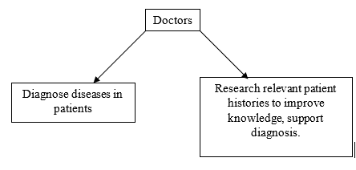
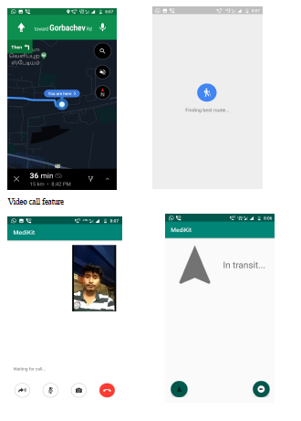
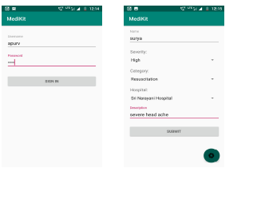

# MediKit
A smart healthcare system to improve service, improve doctor-patient relationships, and and support diagnostic decisions

## Data-driven healthcare

## Smart Emergency Service

Application to integrate attendants in ambulance with hospital for proactive emergency service.

